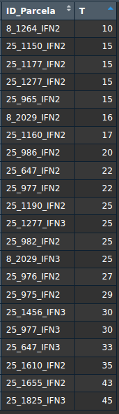

## Introduction

This document presents the basic steps for analyzing simulation results in SIMANFOR.

This code requires user intervention to define some variables before execution.
Additionally, the resulting files from SIMANFOR simulations must:

-   Be uncompressed
-   Be inside a main folder that contains all the results
-   Each simulation group must be in a separate folder within the main folder

*Note: Simulation groups refer to the cases we want to compare with this analysis.* 
*In general, we will compare different forest management scenarios, but we could also compare plots with* 
*different initial densities, site qualities, study areas, species proportions... simulated under the same* 
*management scenario. The image below shows (1) a case study where the same management was applied to stands with* 
*different productivity, and (2) a case study where different management was applied.* 
*You can find these files in the [SIMANFOR results repository](https://github.com/simanfor/resultados)*

*By the way, in these folders you can give a name that represents the group of simulations it contains, *
*such as a specific forest management, a species of interest, a study area, etc. *
*This name will be displayed in the legend of the graphs, so it is important that it is descriptive and short.*


 


# Example 1: Comparison of 3 management scenarios for a common inventory


## Installation and loading of packages

For this code to function correctly, it is necessary to keep the `functions.r` file in the same folder as this 
document. This file contains functions necessary for executing this code.

```{r message=FALSE}
source('functions.r')
install_and_load(c("readxl", "tidyverse", "ggplot2", "viridis"))
# install_and_load(c("tinytex", "rmarkdown", "knitr"))  # these libraries are necessary for the reports creation
```

Setting the working directory would normally be required, but for *.Rmd* files, it is not necessary, as they use 
the folder they are located in as the working directory.

## Initial variable configuration

Now it’s your turn. Configure the following variables for the code to work correctly.
Let’s start with the path to the simulation files. Replace the path below with the path to the 
main folder where your files are located (remember, this should contain subfolders with the results of each 
simulation group). The code will display the files found in that folder.

*Note: If you are working on Windows, remember to change the slash orientation to:* ***/***

```{r}
simulations_path <- '/home/aitor/Downloads/Ps-no_maderables' 
list.files(simulations_path, full.names = TRUE)
```

Next, configure the following variables:

-   *lang* = **Language of the results obtained from SIMANFOR:** `es` (Spanish) or `en` (English)
-   *projection_time* = **Model projection time:** See [model documentation](https://github.com/simanfor/modelos) 
or check the [SIMANFOR website](https://www.simanfor.es/models)
-   *save* = **Do you want to save the graphs you will create?** `yes` or `no`
-   *output_path* = **Graph output path:** Folder where generated graphs will be saved (default is the working directory)

```{r}
lang <- "es"
projection_time <- 5  
save <- "yes"  
output_path <- getwd()  
```

### Loading Simulation Results

The next step is to load the simulation data. For this, we will use the `load_plot_data` function found in 
the `functions.r` file. Your data will be loaded into a data frame called `plots`. Once loaded, 
we will be able to create graphs, but first, it would be useful to explore the data to see which variables 
are available for graphing and what values they take. Remember that the SIMANFOR result files contain a 
"Metadata" sheet where you can check the meaning of each variable and their respective units.
Here are some commands you can use to explore your data:

- **dim(plots)**: Number of rows and columns
- **str(plots)**: Data structure (variable types)
- **glimpse(plots)**: Similar to str(), but more compact
- **names(plots)**: Variable names
- **head(plots, 10)**: First 10 rows of the dataframe
- **tail(plots, 10)**: Last 10 rows of the dataframe
- **summary(plots)**: General descriptive statistics

```{r}
plots <- load_plot_data(simulations_path, lang)
```

Graphs are typically created using stand age to observe its evolution and the effects of silviculture. 
Checking the initial stand age of our plots is a good practice, especially when different initial ages are 
included in the inventory. In our example, it looks like this:



Initial plot ages range from 10 to 45 years. Plots following the same silvicultural guidelines will be averaged, 
and differences in initial stand age may affect the graphs, as we will see later. 
Feel free to explore all available variables to gain a better understanding of your data.

### Creating graphs

Great, we have taken the necessary steps to start graphing the simulation results.
For this, we will use the `graph_selector` function located in the `functions.r` file. This function
allows us to select the type of graph we want to create and customize it to our needs.
To do this, we need to define the following arguments:

- **df:** Data frame with the results (default: `plots`)
- **projection_time:** Model projection time used in the simulations (defined earlier)
- **lang:** Language of the results (defined earlier)
- **save:** Save the graphs (defined earlier)
- **output_path:** Path where the graphs will be saved (defined earlier)
- **graph_type:** Returns a graph showing the evolution of the selected variable throughout the simulation for:
    
  * `"standing"`: Biomass that remains standing and is not harvested
  * `"accumulated"`: The sum of standing biomass and biomass harvested
  * `"standing + accumulated"`: Both results in the same graph
  
- **x_axis_var:** Variable to be represented on the X-axis, chosen from: `T` (stand age), `Year` (year for which 
predictions were made), or `Scenario_age` (simulated time, with your initial inventory having a value of 0).  
*Note: Check your data to see which variables are available (by default, `T` is used). Keep in mind that the results *
*will vary depending on the initial values of these variables in each plot used, as the average value of all of them *
*will be calculated.*
- **y_axis_var:** Variable to be represented on the Y-axis
- **title:** Graph title (omit if not needed)
- **subtitle:** Graph subtitle (omit if not needed)
- **x:** X-axis label (omit if not needed)
- **y:** Y-axis label (omit if not needed)

*Note: The graphs saved on your computer are re scaled to prevent text from being cut off and to improve presentation.*

#### Example graphs: standing values

##### Evolution of stand density

Notice that the extreme variations below 50 years are due to differences in the initial stand age of the plots used, as
we noticed before. Values are averaged by stand age, so if an older plot with a higher density than the previous one 
enters the simulation, the mean density will increase. Conversely, if a new plot with a lower density than the previous 
one enters, the mean density will decrease. Once all plots are included in the simulation, the stand evolution 
becomes smoother and easier to evaluate.

*Note: In all graphs, each group of plots (in this case, each silvicultural scenario) will be represented using a* 
*different color. Each action proposed in our scenario (initialization, projection, or harvest) will be marked on the*
*graph with a distinct symbol. Refer to the legend for more details.*

```{r}
graph_selector(df = plots, projection_time = projection_time, lang = lang, 
               save = save, output_path = output_path,
               graph_type = "standing", x_axis_var = "T", y_axis_var = "N", 
               title = "Density evolution during the simulation period", 
               subtitle = "Pinus sylvestris stands",
               x = "Stand age (years)", y = "Density (trees/ha)")
```

##### Evolution of dominant height

Just to show you how to modify the remaining arguments, this time I'll set the *save* argument to avoid saving the 
graph and remove the *output_path* argument since it won’t be needed.

```{r}
graph_selector(df = plots, projection_time = projection_time, lang = lang, 
               # save = save, output_path = output_path,
               save = 'no',
               graph_type = "standing", x_axis_var = "T", y_axis_var = "Ho", 
               title = "Dominant height evolution during the simulation period", 
               subtitle = "Pinus sylvestris stands",
               x = "Stand age (years)", y = "Dominant height (m)")
```

#### Example graph: accumulated values

##### Evolution of accumulated biomass, including all the tree sections (roots, stem, canopy)

This graph may take a little longer to generate. Please wait, everything is working properly.

In this graph, you can see that both silvicultural scenarios achieve higher biomass production by the end of the 
simulation. Additionally, the **x** symbol (indicating a harvest) is placed at the same position as the projection 
symbol, meaning a harvest occurred, but the extracted biomass was not deducted. These graphs display total biomass 
production, including harvested biomass, to compare overall productivity rather than just the remaining stand biomass.

*Note: It makes sense to use this type of graph for variables such as volume or biomass, while stand density or* 
*dominant height are not suitable for this type of analysis.*

```{r}
graph_selector(df = plots, projection_time = projection_time, lang = lang, 
               save = save, output_path = output_path,
               graph_type = "accumulated", x_axis_var = "T", y_axis_var = "WT",
               title = "Total accumulated biomass evolution during the simulation period",
               subtitle = "Pinus sylvestris stands",
               x = "Stand age (years)", y = "Total accumulated biomass (t/ha)")
```

##### Evolution of accumulated stem biomass, excluding the remaining tree sections (roots, branches and canopy)

Just to show you how to modify the remaining arguments, this time I'll skip both axis labels.

```{r}
graph_selector(df = plots, projection_time = projection_time, lang = lang, 
               save = save, output_path = output_path,
               graph_type = "accumulated", x_axis_var = "T", y_axis_var = "WSW",
               title = "Accumulated stem biomass evolution during the simulation period",
               subtitle = "Pinus sylvestris stands"#,
               #x = "Stand age (years)", y = "Accumulated stem biomass (t/ha)"
               )
```

#### Example graph: standing + accumulated values

##### Volume over bark evolution (standing + accumulated)

In this type of graph, you can directly compare the total yield accumulated during the simulation with the remaining 
production in the living trees at the end of the simulation (standing). Additionally, it allows for the simultaneous 
comparison of all silvicultural scenarios.

*Note: The solid line represents the total production (standing + extracted); the dashed line represents the* 
*standing value*

```{r} 
graph_selector(df = plots, projection_time = projection_time, lang = lang, 
               save = save, output_path = output_path, 
               graph_type = "standing + accumulated", x_axis_var = "T", y_axis_var = "V_con_corteza", 
               title = "Volume over bark evolution during the simulation period", 
               subtitle = "Pinus sylvestris stands", 
               x = "Stand age (years)", y = "Volume over bark (m³/ha)")
```

##### Volume over bark evolution (standing + accumulated) - *x-axis = Year*

Just to show you how to modify the remaining arguments, this time I'll skip the title and subtitle. Additionally, I'll
change the x-axis variable to `Year` to show you how the graph changes.

What’s happening in our graph? Well, it’s a mess... As you may recall, in this example, we are working with multiple 
plots that have different initial conditions. This is why the graph appears so chaotic. The average values are 
calculated based on stand age, but the x-axis displays the *Year* variable instead of stand age. This mismatch causes 
misalignment on the x-axis, making the graph difficult to interpret (and even meaningless). I recommend using stand age 
as the x-axis variable when working with this type of graph. However, if your plots have the same initial conditions, 
you can use the *Year* or *Scenario_age* variable without any issues.

```{r} 
graph_selector(df = plots, projection_time = projection_time, lang = lang, 
               save = save, output_path = output_path, 
               graph_type = "standing + accumulated", x_axis_var = "Anho", y_axis_var = "V_con_corteza", 
               # title = "Volume over bark evolution during the simulation period",
               # subtitle = "Pinus sylvestris stands", 
               x = "Stand age (years)", y = "Volume over bark (m³/ha)")
```

### Data summary: total biomass

In addition to visualizing our results through plots, it's often helpful to create a summary table to track how our 
variable of interest evolves over time. In this case, we're interested in monitoring changes in 
biomass, cumulative values, and extracted values throughout the simulation. To do this, we'll use the 
`get_variable_summary` function, which is defined in the `functions.r` file.

This function allows us to summarize any numeric variable from our dataset, 
grouping it by a selected time-related variable. The function arguments are:

- **df:** Data frame with the results (default: `plots`)
- **x_axis_var:** Variable used to group *y* variable, chosen from: `T` (stand age), `Year` (year for which 
predictions were made), or `Scenario_age` (simulated time, with your initial inventory having a value of 0).  
*Note: Check your data to see which variables are available (by default, `T` is used). Keep in mind that the results *
*will vary depending on the initial values of these variables in each plot used, as the average value of all of them *
*will be calculated.*
- **y_axis_var:** The numeric variable to be summarized
- **projection_time:** Model projection time used in the simulations (defined earlier)
- **lang:** Language of the results (defined earlier)
- **save:** Save the graphs (defined earlier)
- **output_path:** Path where the graphs will be saved (defined earlier)

```{r}
df_wt <- get_variable_summary(df = plots, x_axis_var = "T", y_axis_var = "WT", projection_time = 5, 
                              lang = "es", save = "yes", output_path = output_path)
```                                     

Once the summary table is generated, we can inspect it using basic functions:

```{r}
head(df_wt)
summary(df_wt)
```

### Data summary: new variables

In addition to analyzing existing variables from our results, we can also create new variables by combining others. 
For example, we can calculate aboveground biomass (WSB, which includes stem and branch biomass) by summing the 
following variables:

- **WSW**: stem biomass
- **WTHICKB, WB2_7, WTBL**: different branch sizes biomass

Here's how we compute the new variable and generate its summary:

```{r}
plots$WSB <- plots$WSW + plots$WTHICKB + plots$WB2_7 + plots$WTBL  # calculation of aboveground biomass (t/ha)
df_wsb <- get_variable_summary(df = plots, x_axis_var = "T", y_axis_var = "WSB", projection_time = 5, 
                                    lang = "es", save = "no")
```

# Example 2: Comparison between Site Quality areas

Great! Now, I will repeat the process using another set of simulations. 
This time, I will compare the evolution of a similar stand located in different Site Quality areas under a
common silvicultural scenario. I will skip the explanations this time, as the process is the same as in the previous.
I will only show you the code and the resulting graphs.

```{r}
rm(list = ls())
source('functions.r')
simulations_path <- '/home/aitor/Downloads/Ppinaster-Del_Rio_2006/' 
list.files(simulations_path, full.names = TRUE)
```

```{r}
lang <- "es"
projection_time <- 5  
save <- "no"  
# output_path <- getwd()  
plots <- load_plot_data(simulations_path, lang)
```

#### Example graphs: standing values

##### Evolution of stand density

```{r}
graph_selector(df = plots, projection_time = projection_time, lang = lang, 
               save = save, 
               graph_type = "standing", x_axis_var = "T", y_axis_var = "N", 
               title = "Stand density evolution during the simulation period", 
               subtitle = "Pinus pinaster stands",
               x = "Stand age (years)", y = "Stand density (trees/ha)")
```

##### Evolution of stand basal area

```{r}
graph_selector(df = plots, projection_time = projection_time, lang = lang, 
               save = save, 
               graph_type = "standing", x_axis_var = "T", y_axis_var = "G", 
               title = "Stand basal area evolution during the simulation period", 
               subtitle = "Pinus pinaster stands",
               x = "Stand age (years)", y = "Stand basal area (m²/ha)")
```

##### Evolution of dominant height

```{r}
graph_selector(df = plots, projection_time = projection_time, lang = lang, 
               save = save, 
               graph_type = "standing", x_axis_var = "T", y_axis_var = "Ho", 
               title = "Dominant height evolution during the simulation period", 
               subtitle = "Pinus pinaster stands",
               x = "Stand age (years)", y = "Dominant height (m)")
```

#### Example graph: accumulated values - *x-axis = Year*

##### Evolution of accumulated stem biomass

```{r}
graph_selector(df = plots, projection_time = projection_time, lang = lang, 
               save = save, 
               graph_type = "accumulated", x_axis_var = "Anho", y_axis_var = "WSW", 
               title = "Accumulated stem biomass evolution during the simulation period", 
               subtitle = "Pinus pinaster stands",
               x = "Year", y = "Accumulated stem biomass (t/ha)")
```

##### Evolution of accumulated volume under bark

```{r}
graph_selector(df = plots, projection_time = projection_time, lang = lang, 
               save = save, 
               graph_type = "accumulated", x_axis_var = "Anho", y_axis_var = "V_sin_corteza", 
               title = "Accumulated volume under bark evolution during the simulation period", 
               subtitle = "Pinus pinaster stands",
               x = "Year", y = "Accumulated volume under bark (m³/ha)")
```


#### Example graph: standing + accumulated values - *x-axis = Scenario_age*

##### Evolution of standing + accumulated stem biomass

```{r}
graph_selector(df = plots, projection_time = projection_time, lang = lang, 
               save = save, 
               graph_type = "standing + accumulated", x_axis_var = "Edad_de_escenario", y_axis_var = "WSW", 
               title = "Standing and accumulated stem biomass evolution during the simulation period", 
               subtitle = "Pinus pinaster stands",
               x = "Simulation", y = "Accumulated stem biomass (t/ha)")
```

##### Evolution of standing + accumulated volume under bark

```{r}
graph_selector(df = plots, projection_time = projection_time, lang = lang, 
               save = save, 
               graph_type = "standing + accumulated", x_axis_var = "Edad_de_escenario", y_axis_var = "V_sin_corteza", 
               title = "Standing and accumulated volume under bark evolution during the simulation period", 
               subtitle = "Pinus pinaster stands",
               x = "Simulation", y = "Accumulated volume under bark (m³/ha)")
```