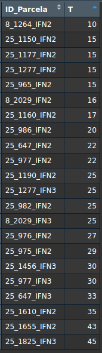

## Introducción

En este archivo se presentan los pasos básicos para el análisis de resultados de simulaciones en SIMANFOR.

Este código necesita la intervención del usuario para definir algunas variables antes de ejecutarlo.
Por otro lado, los archivos resultantes de las simulaciones de SIMANFOR deben:

-   estar descomprimidos
-   estar dentro de una carpeta principal que englobe todos los resultados
-   cada grupo de simulaciones debe estar en una carpeta separada dentro de la carpeta principal 

*Nota: los grupos de simulaciones se refieren a los casos que queremos comparar con este análisis.* 
*Por lo general compararemos distintos escenarios de gestión forestal, pero también podríamos comparar parcelas con* 
*distintas densidades iniciales, calidades de estación, zonas de estudio, proporción de especies... simuladas bajo un* 
*mismo escenario de gestión. En la imagen de a continuación podemos ver (1) un caso de estudio donde se ha aplicado la* 
*misma gestión a masas con distinta productividad, y (2) un caso de estudio donde se ha aplicado distinta gestión.* 
*Puedes encontrar estos archivos en el repositorio de [resultados de SIMANFOR](https://github.com/simanfor/resultados)*

*Por cierto, en estas carpetas puedes poner un nombre que represente el grupo de simulaciones que contiene, como por *
*ejemplo una gestión forestal concreta, una especie de interés, una zona de estudio, etc.*
*Este nombre será el que se muestre en la leyenda de los gráficos, por lo que es importante que sea descriptivo y corto.*

 


## Instalación y carga de paquetes

Para que este código funcione correctamente, es necesario mantener el archivo `functions.r` en la misma carpeta que este 
archivo. Este archivo contiene funciones necesarias para la ejecución de este código.

```{r message=FALSE}
source('functions.r')
install_and_load(c("readxl", "tidyverse", "ggplot2", "viridis"))
```

Sería necesario establecer nuestro directorio de trabajo, pero con los archivos *.Rmd* no es necesario, ya que toman
como directorio de trabajo la carpeta donde se encuentran.


## Configuración inicial de variables

Ahora es tu turno. Configura las siguientes variables para que el código funcione correctamente.
Comencemos con la ruta de los archivos de simulación. Sustituye la ruta que aparece a continuación por la ruta de la
carpeta principal donde se encuentran tus archivos (recuerda, esta debe tener subcarpetas con los resultados de cada
grupo de simulaciones). El código se mostrará los archivos que se encuentran en esa carpeta.

*Nota: si estás trabajando en Windows, recuerda cambiar la orientación de las barras a esta:* ***/***

```{r}
simulations_path <- '/home/aitor/Downloads/Ps-no_maderables' 
list.files(simulations_path, full.names = TRUE)
```

Continuemos configurando las siguientes variables:

-   *lang* = **Idioma de los resultados obtenidos de SIMANFOR:** `es` (Español) o `en` (Inglés)
-   *projection_time* = **Tiempo de proyección del modelo:** Ver [documentación del modelo](https://github.com/simanfor/modelos) 
o consultar dato en la [página web de SIMANFOR](https://www.simanfor.es/models)
-   *save* = **Quieres guardar los gráficos que vas a crear?** `si` o `no`
-   *output_path* = **Ruta de salida de gráficos:** Carpeta donde se guardarán los gráficos generados (por defecto 
es la carpeta de trabajo)

```{r}
lang <- "es"
projection_time <- 5  
save <- "si"  
output_path <- getwd()  
```


### Carga de resultados

El siguiente paso es cargar los datos de las simulaciones. Para ello, usaremos la función `load_plot_data` que se
encuentra en el archivo `functions.r`. Tus datos se cargarán en un data frame llamado `plots`. Una vez cargados,
podremos graficar los resultados, pero antes, sería interesante echar un vistazo a los datos para conocer qué variables 
tenemos disponibles para graficar y qué valores toman. Recuerda que en los archivos de resultados de SIMANFOR tienes una
hoja llamada "Metadatos" donde puedes consultar el significado de cada variable y las unidades en las que se expresan.
Te dejo por aquí una serie de comandos que puedes utilizar para explorar tus datos:

- **dim(plots)**: Número de filas y columnas
- **str(plots)**: Estructura de los datos (tipos de variables)
- **glimpse(plots)**: Similar a str(), pero más compacto
- **names(plots)**: Nombres de las variables
- **head(plots, 10)**: Primeras 10 filas del dataframe
- **tail(plots, 10)**: Últimas 10 filas
- **summary(plots)**: Estadísticas descriptivas generales

```{r}
plots <- load_plot_data(simulations_path, lang)
```

Los gráficos suelen crearse utilizando la edad del rodal para observar su evolución y los efectos de la silvicultura.
Verificar la edad inicial del rodal en nuestras parcelas es una buena práctica, especialmente cuando el inventario 
incluye diferentes edades iniciales. En nuestro ejemplo, se ve así:



Las edades iniciales de las parcelas varían entre 10 y 45 años. Las parcelas que siguen la misma selvicultura se 
promediarán, y las diferencias en la edad inicial del rodal pueden afectar los gráficos, como veremos más adelante.
Siéntete libre de explorar todas las variables disponibles para comprender mejor tus datos.


### Creación de gráficos

Genial, ya hemos dado los pasos necesarios para comenzar a graficar los resultados de las simulaciones.
Para ello vamos a utilizar la función `graph_selector` que se encuentra en el archivo `functions.r`. Esta función
nos permitirá seleccionar el tipo de gráfico que queremos crear y personalizarlo según nuestras necesidades.
Para ello, debemos definir los siguientes argumentos:

- **df:** Data frame con los resultados (por defecto, `plots`)
- **projection_time:** Tiempo de proyección del modelo usado en las simulaciones (lo hemos definido anteriormente)
- **lang:** Idioma de los resultados (lo hemos definido anteriormente)
- **save:** Guardar los gráficos (lo hemos definido anteriormente)
- **output_path:** Ruta donde se guardarán los gráficos (lo hemos definido anteriormente)
- **graph_type:** Devuelve un gráfico donde se muestra la evolución de la variable seleccionada a lo largo de la simulación para:
    
  * `"en pie"`: masa que permanece en pie y no es extraída mediante cortas
  * `"acumulado"`: la suma de la masa en pie y la masa extraída mediante cortas
  * `"en pie + acumulado"`: ambos resultados en un mismo gráfico
  
- **x_axis_var:** Variable a representar en el eje X, a elegir entre: `T` (edad de la masa), `Anho` (año para el 
que se han hecho las predicciones), o `Edad_de_escenario` (tiempo simulado, teniendo tu inventario inicial el valor 0). 
*Nota: revisa tus datos para saber qué variables tienes disponibles (por defecto se utiliza `T`). Ten en cuenta que*
*los resultados serán diferentes dependiendo de los valores iniciales de estas variables en cada parcela utilizada, *
*puesto que se calculará el valor promedio de todas ellas*
- **y_axis_var:** Variable numérica a graficar en el eje Y
- **title:** Título del gráfico (no lo incluyas si no quieres título)
- **subtitle:** Subtítulo del gráfico (no lo incluyas si no quieres subtítulo)
- **x:** Etiqueta del eje X (no lo incluyas si no quieres etiqueta)
- **y:** Etiqueta del eje Y (no lo incluyas si no quieres etiqueta)

*Nota: los gráficos guardados en tu ordenador están reescalados para evitar cortes en el texto y mejorar la presentación*


#### Ejemplo de gráficos: valores en pie  

##### Evolución de la densidad del rodal  

Ten en cuenta que las variaciones extremas por debajo de los 50 años se deben a las diferencias en la edad inicial del 
rodal en las parcelas utilizadas, como mencionamos anteriormente. Los valores se promedian según la edad del rodal, 
por lo que, si una parcela más madura con una densidad mayor que la anterior entra en la simulación, la densidad media 
aumentará. Por el contrario, si ingresa una nueva parcela con una densidad menor que la anterior, la densidad media 
disminuirá. Una vez que todas las parcelas están incluidas en la simulación, la evolución del rodal se vuelve más 
estable y fácil de evaluar.  

*Nota: En todos los gráficos, cada grupo de parcelas (en este caso, cada escenario selvícola) se representará con un*  
*color diferente. Cada acción propuesta en nuestro escenario (inicialización, proyección o cosecha) se marcará en el*  
*gráfico con un símbolo distinto. Consulta la leyenda para más detalles.*

```{r}
graph_selector(df = plots, projection_time = projection_time, lang = lang, 
               save = save, output_path = output_path,
               graph_type = "en pie", x_axis_var = "T", y_axis_var = "N", 
               title = "Evolución de la densidad durante la simulación", 
               subtitle = "Masas de Pinus sylvestris",
               x = "Edad de la masa (años)", y = "Densidad (pies/ha)")
```

##### Evolución de la altura dominante  

Para mostrarte cómo modificar los argumentos restantes, esta vez estableceré el argumento *save* para evitar guardar 
el gráfico y eliminaré el argumento *output_path*, ya que no será necesario.

```{r}
graph_selector(df = plots, projection_time = projection_time, lang = lang, 
               # save = save, output_path = output_path,
               save = 'no',
               graph_type = "en pie", x_axis_var = "T", y_axis_var = "Ho", 
               title = "Evolución de la altura dominante durante la simulación", 
               subtitle = "Masas de Pinus sylvestris",
               x = "Edad de la masa (años)", y = "Altura dominante (m)")
```

#### Ejemplo de gráfico: valores acumulados  

##### Evolución de la biomasa acumulada, incluyendo todas las secciones del árbol (raíces, tronco, copa)  

Este gráfico puede tardar un poco más en generarse. Por favor, espera, todo está funcionando correctamente.  

En este gráfico puedes observar que ambos escenarios selvícolas logran una mayor producción de biomasa al final de la 
simulación. Además, el símbolo **x** (que indica una corta) se encuentra en la misma posición que el símbolo de 
proyección, lo que significa que se realizó una corta, pero la biomasa extraída no fue descontada. Estos gráficos 
muestran la producción total de biomasa, incluyendo la biomasa extraída en las cortas, para comparar la productividad 
general en lugar de solo la biomasa que permanece en el rodal.  

*Nota: Tiene sentido usar este tipo de gráfico para variables como el volumen o la biomasa, mientras que la densidad*
*del rodal o la altura dominante no son adecuadas para este tipo de análisis.*

```{r}
graph_selector(df = plots, projection_time = projection_time, lang = lang, 
               save = save, output_path = output_path,
               graph_type = "acumulado", x_axis_var = "T", y_axis_var = "WT",
               title = "Evolución de la biomasa total acumulada durante la simulación",
               subtitle = "Masas de Pinus sylvestris",
               x = "Edad de la masa (años)", y = "Biomasa total acumulada (t/ha)")
```

##### Evolución de la biomasa acumulada del tronco, excluyendo las demás secciones del árbol (raíces, ramas y copa)  

Para mostrarte cómo modificar los argumentos restantes, esta vez omitiré las etiquetas de ambos ejes.

```{r}
graph_selector(df = plots, projection_time = projection_time, lang = lang, 
               save = save, output_path = output_path,
               graph_type = "acumulado", x_axis_var = "T", y_axis_var = "WSW",
               title = "Evolución de la biomasa del tronco acumulada durante la simulación",
               subtitle = "Masas de Pinus sylvestris"#,
               #x = "Edad de la masa (años)", y = "Biomasa acumulada del tronco (t/ha)"
               )
```

#### Ejemplo de gráfico: valores en pie + acumulados  

##### Evolución del volumen con corteza (en pie + acumulado)  

En este tipo de gráfico, puedes comparar directamente la producción total acumulada durante la simulación con la 
producción que permanece en el monte en los árboles vivos al final de la simulación (en pie). Además, permite la 
comparación simultánea de todos los escenarios selvícolas.  

*Nota: La línea sólida representa la producción total (en pie + extraída); la línea discontinua representa el valor en pie.*

```{r} 
graph_selector(df = plots, projection_time = projection_time, lang = lang, 
               save = save, output_path = output_path, 
               graph_type = "en pie + acumulado", x_axis_var = "T", y_axis_var = "V_con_corteza", 
               title = "Evolución del volumen con corteza durante la simulación", 
               subtitle = "Masas de Pinus sylvestris", 
               x = "Edad de la masa (años)", y = "Volumen con corteza (m³/ha)")
```

##### Evolución del volumen con corteza (en pie + acumulado) - *Eje X = Año*  

Para mostrarte cómo modificar los argumentos restantes, esta vez omitiré el título y el subtítulo. Además, cambiaré la 
variable del eje X a `Anho` para mostrarte cómo cambia el gráfico.  

¿Qué está ocurriendo en nuestro gráfico? Bueno, es un desastre... Como recordarás, en este ejemplo estamos trabajando 
con múltiples parcelas que tienen diferentes condiciones iniciales. Por esta razón, el gráfico parece tan caótico. 
Los valores promedio se calculan en función de la edad del rodal, pero el eje X muestra la variable *Year* en lugar de 
la edad del rodal. Esta discrepancia provoca un desalineamiento en el eje X, lo que dificulta la interpretación del 
gráfico (y lo vuelve poco interesante).  

Recomiendo usar la edad del rodal como variable del eje X al trabajar con este tipo de gráfico. Sin embargo, si tus 
parcelas tienen las mismas condiciones iniciales, puedes usar las variables *Anho* o *Edad_de_escenario* sin problemas.

```{r} 
graph_selector(df = plots, projection_time = projection_time, lang = lang, 
               save = save, output_path = output_path, 
               graph_type = "en pie + acumulado", x_axis_var = "Anho", y_axis_var = "V_con_corteza", 
               # title = "Evolución del volumen con corteza durante la simulación",
               # subtitle = "Masas de Pinus sylvestris", 
               x = "Edad de la masa (años)", y = "Volumen con corteza (m³/ha)")
```


# Ejemplo 2: Comparación entre distinas Calidades de Estación

¡Genial! Ahora repetiré el proceso utilizando otro conjunto de simulaciones.  
Esta vez, compararé la evolución de un rodal similar ubicado en diferentes áreas de Calidad de Estación bajo un 
escenario selvícola común.  

Esta vez omitiré las explicaciones, ya que el proceso es el mismo que en el caso anterior.  
Solo te mostraré el código y los gráficos resultantes.

```{r}
rm(list = ls())
source('functions.r')
simulations_path <- '/home/aitor/Downloads/Ppinaster-Del_Rio_2006/' 
list.files(simulations_path, full.names = TRUE)
```

```{r}
lang <- "es"
projection_time <- 5  
save <- "no"  
# output_path <- getwd()  
plots <- load_plot_data(simulations_path, lang)
```

#### Ejemplo de gráficos: valores en pie  

##### Evolución de la densidad del rodal

```{r}
graph_selector(df = plots, projection_time = projection_time, lang = lang, 
               save = save, 
               graph_type = "en pie", x_axis_var = "T", y_axis_var = "N", 
               title = "Evolución de la densidad a lo largo de la simulación", 
               subtitle = "Masas de Pinus pinaster",
               x = "Edad de la masa (años)", y = "Densidad (pies/ha)")
```

##### Evolución del área basimétrica del rodal

```{r}
graph_selector(df = plots, projection_time = projection_time, lang = lang, 
               save = save, 
               graph_type = "en pie", x_axis_var = "T", y_axis_var = "G", 
               title = "Evolución del área basimétrica a lo largo de la simulación", 
               subtitle = "Masas de Pinus pinaster",
               x = "Edad de la masa (años)", y = "Área basimétrica (m²/ha)")
```

##### Evolución de la altura dominante del rodal

```{r}
graph_selector(df = plots, projection_time = projection_time, lang = lang, 
               save = save, 
               graph_type = "en pie", x_axis_var = "T", y_axis_var = "Ho", 
               title = "Evolución de la altura dominante a lo largo de la simulación", 
               subtitle = "Masas de Pinus pinaster",
               x = "Edad de la masa (años)", y = "Altura dominante (m)")
```

#### Ejemplo de gráfico: valores acumulados - *Eje X = Año*  

##### Evolución de la biomasa acumulada del tronco

```{r}
graph_selector(df = plots, projection_time = projection_time, lang = lang, 
               save = save, 
               graph_type = "acumulado", x_axis_var = "Anho", y_axis_var = "WSW", 
               title = "Evolución de la biomasa acumulada del tronco durante la simulación", 
               subtitle = "Masas de Pinus pinaster",
               x = "Año", y = "Biomasa acumulada del tronco (t/ha)")
```

##### Evolución del volumen sin corteza

```{r}
graph_selector(df = plots, projection_time = projection_time, lang = lang, 
               save = save, 
               graph_type = "acumulado", x_axis_var = "Anho", y_axis_var = "V_sin_corteza", 
               title = "Evolución del volumen sin corteza acumulado durante la simulación", 
               subtitle = "Masas de Pinus pinaster",
               x = "Año", y = "Volumen sin corteza (m³/ha)")
```


#### Ejemplo de gráfico: valores en pie + acumulados - *Eje X = Edad_de_escenario*  

##### Evolución de la biomasa del tronco en pie + acumulada

```{r}
graph_selector(df = plots, projection_time = projection_time, lang = lang, 
               save = save, 
               graph_type = "en pie + acumulado", x_axis_var = "Edad_de_escenario", y_axis_var = "WSW", 
               title = "Evolución de la biomasa acumulada y en pie del tronco durante la simulación", 
               subtitle = "Masas de Pinus pinaster",
               x = "Simulación", y = "Biomasa acumulada del tronco (t/ha)")
```

##### Evolución del volumen sin corteza en pie + acumulado

```{r}
graph_selector(df = plots, projection_time = projection_time, lang = lang, 
               save = save, 
               graph_type = "en pie + acumulado", x_axis_var = "Edad_de_escenario", y_axis_var = "V_sin_corteza", 
               title = "Evolución del volumen sin corteza acumulado y en pie durante la simulación", 
               subtitle = "Masas de Pinus pinaster",
               x = "Simulación", y = "Volumen sin corteza (m³/ha)")
```